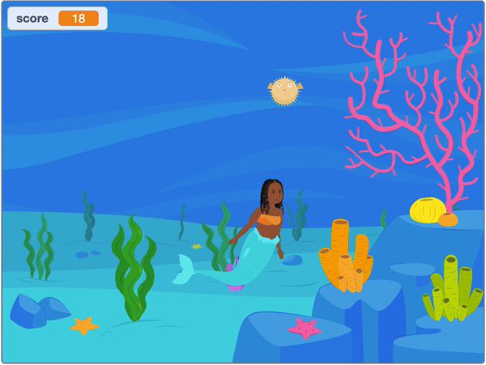
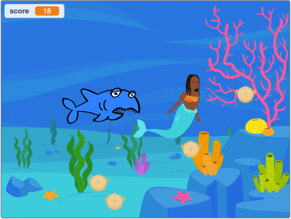

# Mermaid Game

Live Demo: [https://scratch.mit.edu/projects/564564144](https://scratch.mit.edu/projects/564564144/)

## Description:

A basic catching game built in Scratch for CS50.

## How to Play:

Visit the [Live Demo](https://scratch.mit.edu/projects/564564144/). Use the arrow keys (right, left, up, down) to move the mermaid. Press the space bar to reach for pufferfish. Collect 20 pufferfish, while avoiding the hungry shark to win the game.

## Tech:

[Scratch](https://scratch.mit.edu/)

## Features:

In addition to the features required by the assignment, the mermaid game has some built in nuances I included to challenge myself further.

- [x] Conditionals preventing the shark from bothering you when you have 0 pufferfish.
- [x] Costume changes dependent on a sprite's proximity to the mermaid sprite and/or other targets.
- [x] Slightly more advanced hit detection, dependent on multiple factors.
- [x] Option to restart the game after winning.

 \
_The shark will only bother you if you have pufferfish for him to eat._
